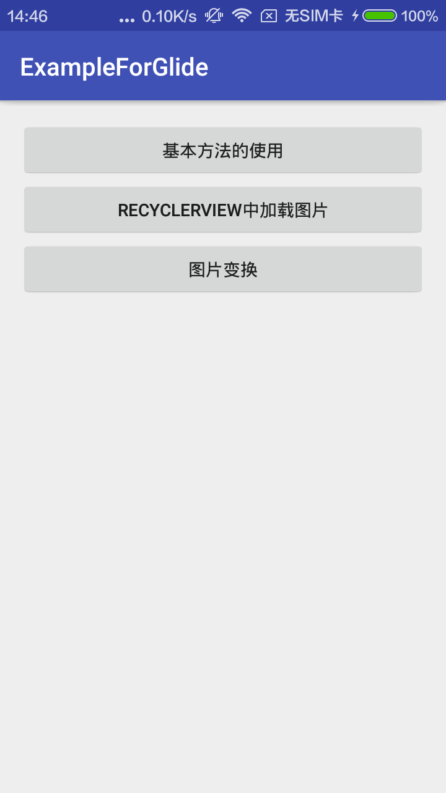
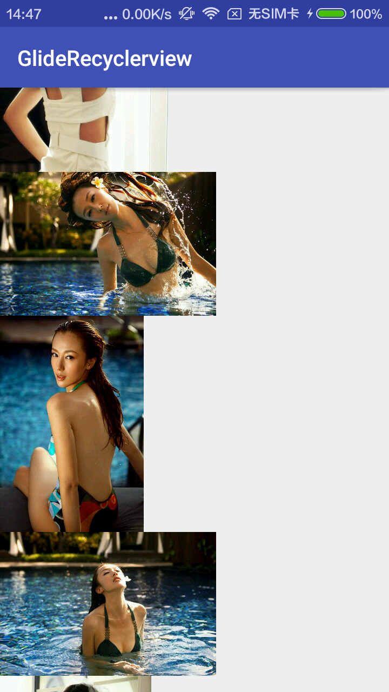
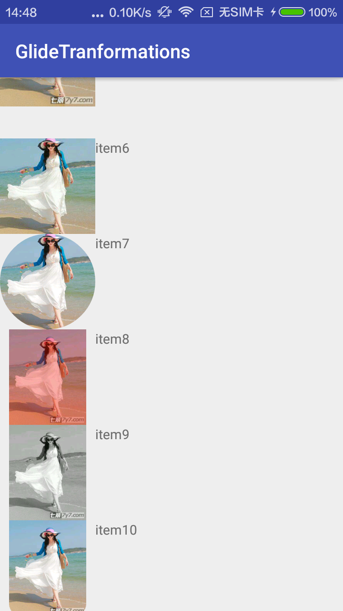

# ExampleForGlide

This is a demo for Glide

# Libraries
>com.android.support:recyclerview-v7:24.2.1'

>com.github.bumptech.glide:glide:3.7.0'

>com.android.support:appcompat-v7:24.2.1'

>com.jakewharton:butterknife:7.0.1'

>jp.wasabeef:glide-transformations:2.0.1'

>jp.co.cyberagent.android.gpuimage:gpuimage-library:1.3.0'

## Screenshots

##About me
I am a student in China, I love reading novel, love music. 
At the same time, I am also obsessed with writing code.
If you have any new idea about this project,welcome to [contact me:veyron_gz@163.com](mailto:veyron_gz@163.com). :smiley:

In addition, my blog: [http://blog.csdn.net/leaf_130](http://blog.csdn.net/leaf_130)

##LICENSE

